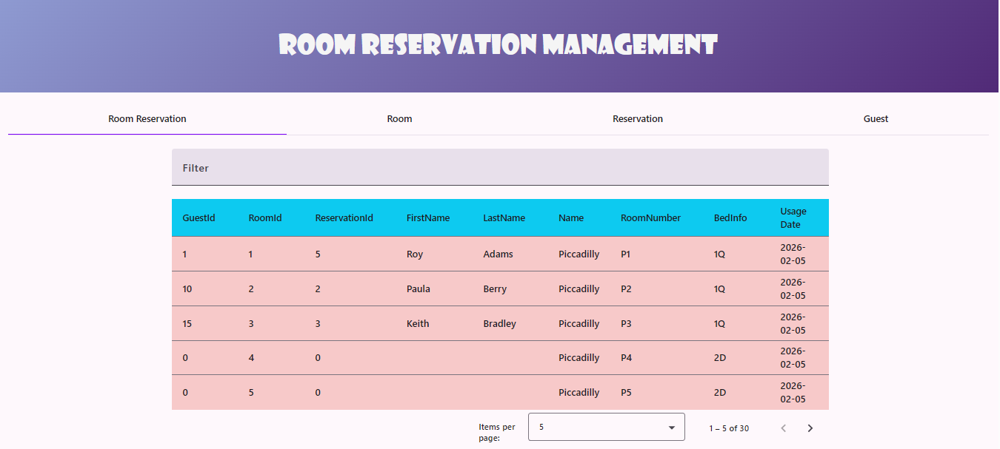
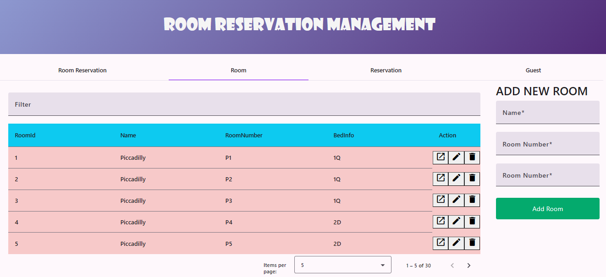
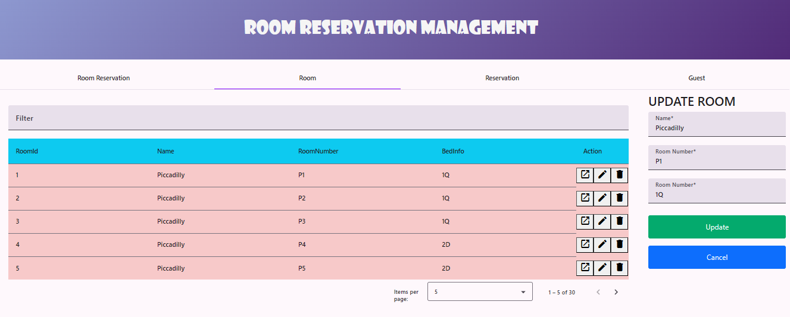
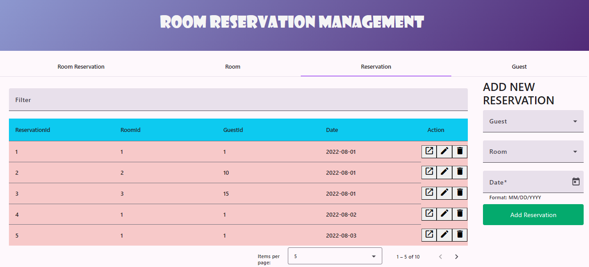
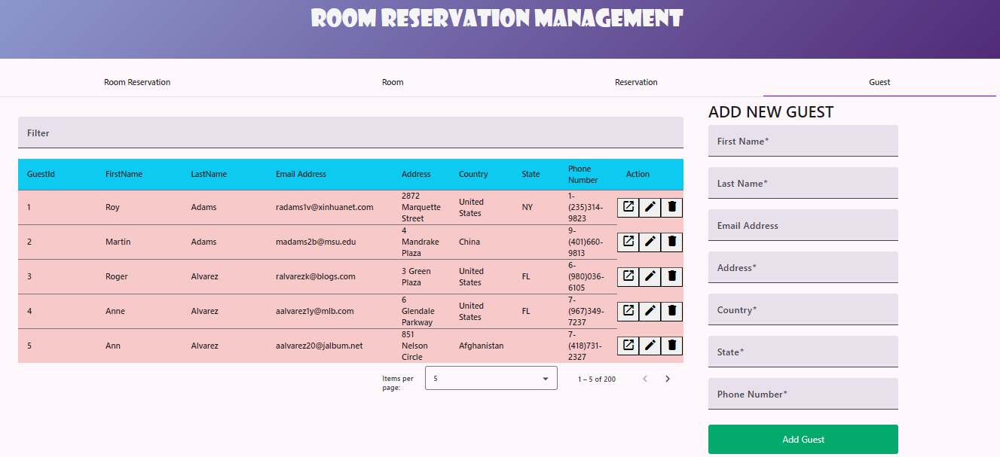

# Hotel Management System - Spring Cloud Microservices

##  Description du Projet

Système de gestion hôtelière construit avec une architecture microservices utilisant Spring Cloud. Le système permet de gérer les réservations de chambres, les clients et les informations sur les chambres d'hôtel.

##  Architecture

Ce projet suit une architecture microservices avec les composants suivants :

```
┌─────────────────────────────────────────────────────────────┐
│                      Eureka Server                          │
│                  (Service Discovery)                        │
│                    Port: 8761                               │
└─────────────────────────────────────────────────────────────┘
                            │
                            │ Registration
                            ▼
┌─────────────────────────────────────────────────────────────┐
│                    Config Server                            │
│              (Centralized Configuration)                    │
│                    Port: 8888                               │
└─────────────────────────────────────────────────────────────┘
                            │
                            │ Configuration
                            ▼
┌──────────────────┬──────────────────┬──────────────────────┐
│  Guest Service   │ Reservation Svc  │   Room Service       │
│   Port: 9081     │   Port: 9082     │    Port: 9083        │
└──────────────────┴──────────────────┴──────────────────────┘
                            │
                            │ Feign Clients
                            ▼
                ┌───────────────────────────┐
                │ Room Reservation Service  │
                │      (Aggregator)         │
                │       Port: 8080          │
                └───────────────────────────┘
```

## UI
### Room reservation Interface

### Room Interface


### Reservation Interface

### Guest Interface

##  Microservices

### 1. **Config Server** (Port: 8888)
- **Rôle** : Gestion centralisée de la configuration pour tous les microservices
- **Technologie** : Spring Cloud Config Server
- **Mode** : Native (lecture depuis système de fichiers local)
- **Emplacement des configs** : `./etc/`

### 2. **Eureka Server** (Port: 8761)
- **Rôle** : Service Discovery - registre de tous les microservices
- **Technologie** : Spring Cloud Netflix Eureka
- **Console Web** : http://localhost:8761

### 3. **Guest Service** (Port: 9081)
- **Rôle** : Gestion des clients de l'hôtel
- **Base de données** : JPA/Hibernate
- **Endpoints** :
  - `GET /guests` - Liste tous les clients
  - `GET /guests/{guestId}` - Récupère un client
  - `POST /guests` - Crée un nouveau client
  - `PUT /guests/{guestId}` - Met à jour un client
  - `DELETE /guests/{guestId}` - Supprime un client

### 4. **Reservation Service** (Port: 9082)
- **Rôle** : Gestion des réservations
- **Base de données** : JPA/Hibernate
- **Endpoints** :
  - `GET /reservations` - Liste toutes les réservations
  - `GET /reservations/{reservationId}` - Récupère une réservation
  - `POST /reservations` - Crée une nouvelle réservation
  - `PUT /reservations/{reservationId}` - Met à jour une réservation
  - `DELETE /reservations/{reservationId}` - Supprime une réservation

### 5. **Room Service** (Port: 9083)
- **Rôle** : Gestion des chambres d'hôtel
- **Base de données** : JPA/Hibernate
- **Endpoints** :
  - `GET /rooms` - Liste toutes les chambres
  - `GET /rooms/{roomId}` - Récupère une chambre
  - `POST /rooms` - Crée une nouvelle chambre
  - `PUT /rooms/{roomId}` - Met à jour une chambre
  - `DELETE /rooms/{roomId}` - Supprime une chambre

### 6. **Room Reservation Service** (Port: 8081)
- **Rôle** : Service d'agrégation - point d'entrée principal pour les clients
- **Technologie** : Spring Cloud OpenFeign
- **Circuit Breaker** : Activé
- **Endpoints principaux** :
  - `GET /roomReservations` - Vue complète des réservations avec détails
  - `GET /roomReservations/rooms` - Proxy vers Room Service
  - `GET /roomReservations/reservations` - Proxy vers Reservation Service
  - `GET /roomReservations/guests` - Proxy vers Guest Service

##  Démarrage du Projet

### Prérequis

- Java 21
- Maven 3.8+
- Spring Boot 3.2.2
- Spring Cloud 2023.0.0

### Ordre de démarrage

**IMPORTANT** : Les services doivent être démarrés dans cet ordre :

1. **Config Server** (en premier)
   ```bash
   cd config-server
   mvn spring-boot:run
   ```
   Vérifiez : http://localhost:8888/actuator/health

2. **Eureka Server** (en second)
   ```bash
   cd eureka-server
   mvn spring-boot:run
   ```
   Vérifiez : http://localhost:8761

3. **Services métier** (en parallèle)
   ```bash
   # Terminal 1
   cd guest-service
   mvn spring-boot:run

   # Terminal 2
   cd reservation-service
   mvn spring-boot:run

   # Terminal 3
   cd room-service
   mvn spring-boot:run
   ```

4. **Room Reservation Service** (en dernier)
   ```bash
   cd room-reservation-service
   mvn spring-boot:run
   ```

### Vérification

Une fois tous les services démarrés :

- Eureka Dashboard : http://localhost:8761
- Config Server : http://localhost:8888/guest-service/default
- API principale : http://localhost:8080/roomReservations

##  Configuration

### Structure des fichiers de configuration

```
etc/
├── application.properties              # Configuration commune à tous les services
├── guest-service.properties           # Configuration spécifique à Guest Service
├── reservation-service.properties     # Configuration spécifique à Reservation Service
├── room-service.properties            # Configuration spécifique à Room Service
└── room-reservation-service.properties # Configuration spécifique à Room Reservation Service
```

### Configuration par service

**etc/guest-service.properties**
```properties
server.port=9081
spring.jpa.hibernate.ddl-auto=none
```

**etc/reservation-service.properties**
```properties
server.port=9082
spring.jpa.hibernate.ddl-auto=none
```

**etc/room-service.properties**
```properties
server.port=9083
spring.jpa.hibernate.ddl-auto=none
```

**etc/room-reservation-service.properties**
```properties
server.port=8080
feign.circuitbreaker.enabled=true
GUEST_SERVICE_URL=http://localhost:9081
RESERVATION_SERVICE_URL=http://localhost:9082
ROOM_SERVICE_URL=http://localhost:9083
```

##  API Endpoints

### Room Reservation Service (Agrégateur)

#### Obtenir toutes les réservations avec détails
```http
GET http://localhost:8080/roomReservations
GET http://localhost:8080/roomReservations?date=2024-02-01
```

#### Gestion des chambres
```http
GET    http://localhost:8080/roomReservations/rooms
GET    http://localhost:8080/roomReservations/rooms/{roomId}
POST   http://localhost:8080/roomReservations/rooms
PUT    http://localhost:8080/roomReservations/rooms/{roomId}
DELETE http://localhost:8080/roomReservations/rooms/{roomId}
```

#### Gestion des réservations
```http
GET    http://localhost:8080/roomReservations/reservations
GET    http://localhost:8080/roomReservations/reservations/{reservationId}
POST   http://localhost:8080/roomReservations/reservations
PUT    http://localhost:8080/roomReservations/reservations/{reservationId}
DELETE http://localhost:8080/roomReservations/reservations/{reservationId}
```

#### Gestion des clients
```http
GET    http://localhost:8080/roomReservations/guests
GET    http://localhost:8080/roomReservations/guests/{guestId}
POST   http://localhost:8080/roomReservations/guests
PUT    http://localhost:8080/roomReservations/guests/{guestId}
DELETE http://localhost:8080/roomReservations/guests/{guestId}
```

##  Technologies Utilisées

- **Spring Boot 3.2.2** - Framework principal
- **Spring Cloud 2023.0.0** - Suite de microservices
- **Spring Cloud Config** - Configuration centralisée
- **Spring Cloud Netflix Eureka** - Service Discovery
- **Spring Cloud OpenFeign** - Client HTTP déclaratif
- **Spring Cloud Circuit Breaker** - Résilience
- **Spring Data JPA** - Accès aux données
- **Hibernate** - ORM
- **Maven** - Gestion des dépendances

##  Modèle de Données

### Guest (Client)
```json
{
  "guestId": 1,
  "firstName": "John",
  "lastName": "Doe"
}
```

### Room (Chambre)
```json
{
  "roomId": 1,
  "roomNumber": "101",
  "name": "Deluxe Suite",
  "bedInfo": "2 Queen Beds"
}
```

### Reservation (Réservation)
```json
{
  "reservationId": 1,
  "roomId": 1,
  "guestId": 1,
  "date": "2024-02-01"
}
```

### RoomReservation (Vue agrégée)
```json
{
  "roomId": 1,
  "roomNumber": "101",
  "name": "Deluxe Suite",
  "bedInfo": "2 Queen Beds",
  "reservationId": 1,
  "guestId": 1,
  "firstName": "John",
  "lastName": "Doe",
  "date": "2024-02-01"
}
```

##  Dépannage

### Les services ne se trouvent pas
- Vérifiez qu'Eureka Server est démarré et accessible
- Attendez 30-60 secondes après le démarrage pour l'enregistrement

### Configuration non chargée
- Vérifiez que Config Server est démarré en premier
- Vérifiez les fichiers dans le dossier `etc/`
- Consultez les logs du Config Server

### Erreur de port déjà utilisé
- Vérifiez qu'aucun autre processus n'utilise les ports
- Modifiez les ports dans les fichiers de configuration du dossier `etc/`

### Circuit Breaker activé
- Le service cible est peut-être indisponible
- Vérifiez les logs pour voir quel service est en erreur

## 📝 Remarques

- **CORS** : Activé sur tous les endpoints (`@CrossOrigin("*")`)
- **Circuit Breaker** : Activé pour améliorer la résilience
- **Configuration centralisée** : Toute modification dans `etc/` nécessite un redémarrage du service concerné
- **Mode développement** : Configuration actuelle adaptée pour l'environnement local

## 🤝 Contribution

Pour contribuer au projet :
1. Créez une branche pour votre fonctionnalité
2. Commitez vos changements
3. Poussez vers la branche
4. Créez une Pull Request

## 📄 Licence

Ce projet est un projet éducatif basé sur LinkedIn Learning.
